# Language Translation Transformer
This repository contains implementations of English to Hindi and English to Italian translation using Transformers with modular coding and logs functionality.

### With Modular Approach & Logs Functionality
For a more modular and maintainable implementation, refer to the Language_Translation_Transformer_With_Modular_Coding_v2 directory.
 - For English to Italian, Go to Language_Translation_Transformer_With_Modular_Coding
 - For English to Hindi, Go to Language_Translation_Transformer_With_Modular_Coding_v2
 - Install dependencies: pip install -r requirements.txt
 - Run the model (using PyTorch GPU): python main.py

### Non-Modular Approach (English to Italian Only)
For a simpler, non-modular implementation, refer to the Language_Translation_Transformer_Without_Modular_Coding directory.
 - Install dependencies: pip install -r requirements.txt
 - Install requirements.txt
 - Run the model: jupyter notebook Ipynb_file.ipynb

## Explanation video Hinglish : https://youtu.be/4haIxWjNZAc
## Explanation Video English : https://youtu.be/W7Oy2-bf7aI

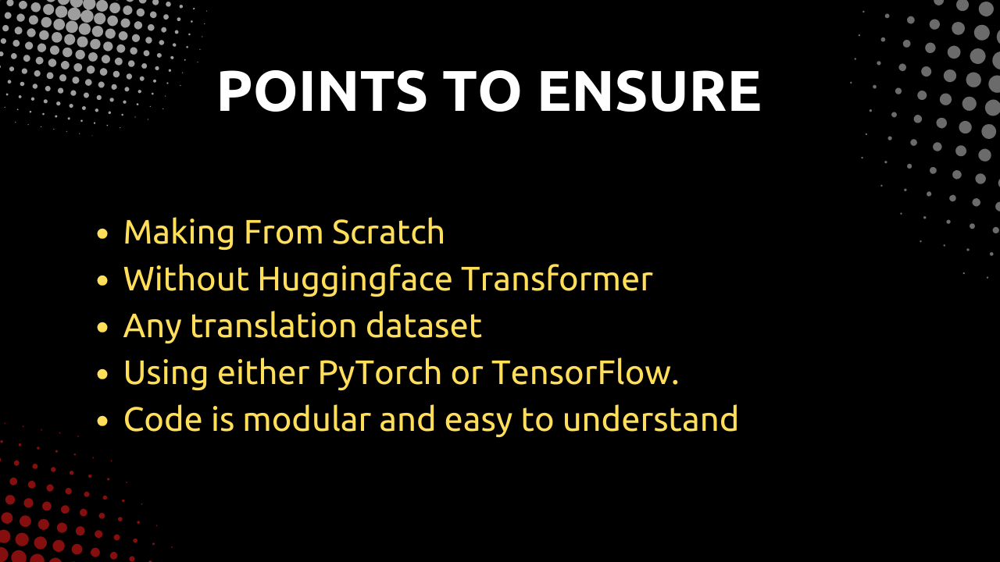

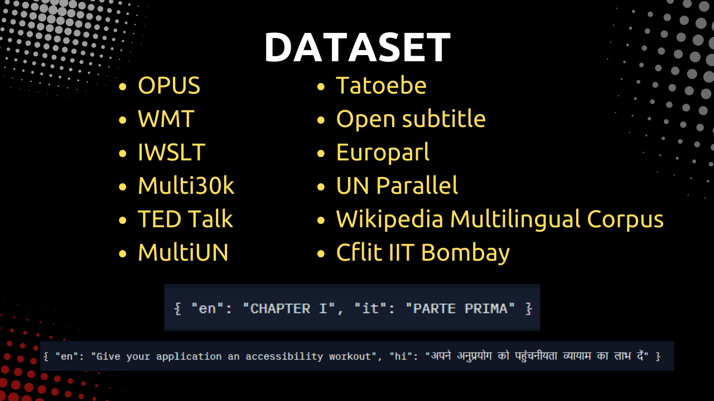
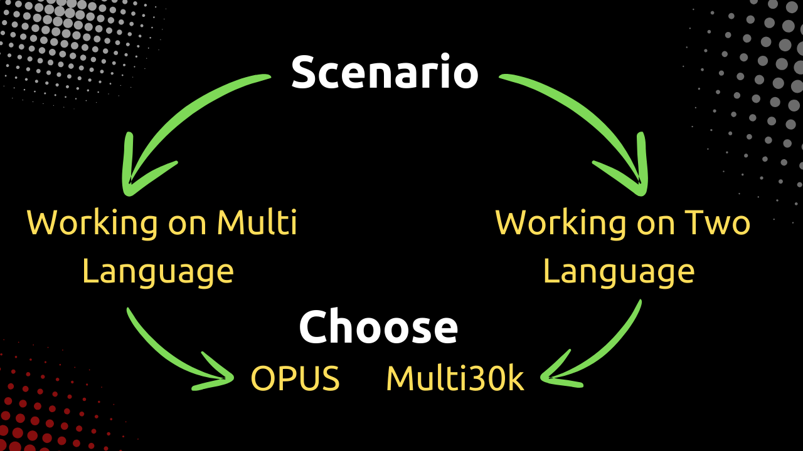
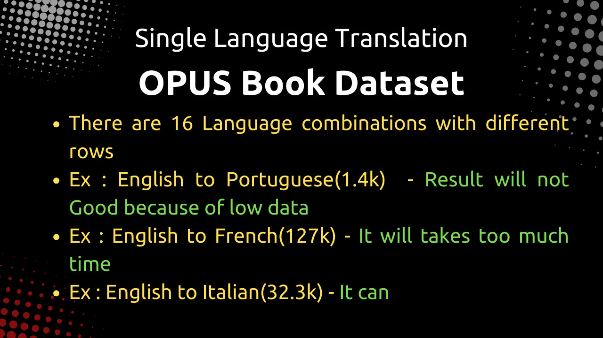
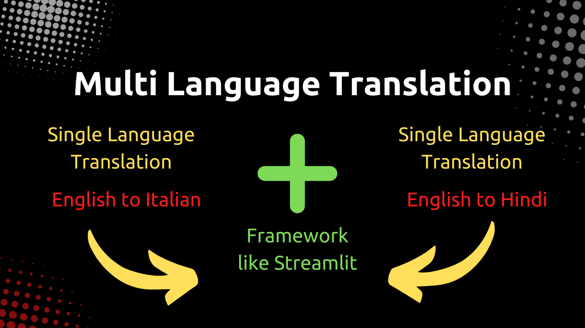
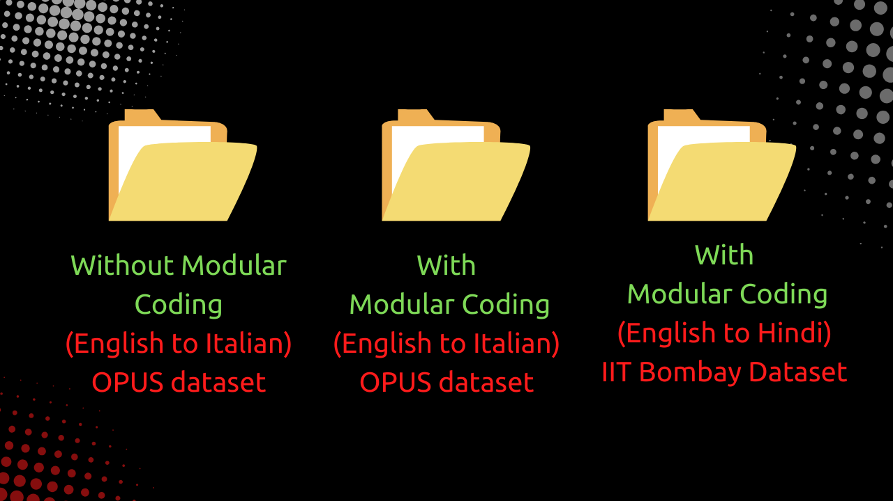
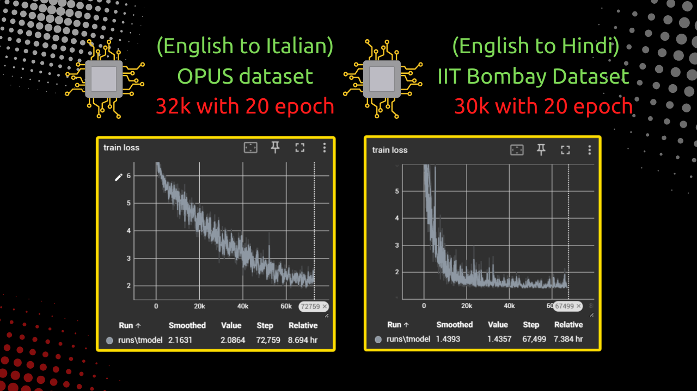
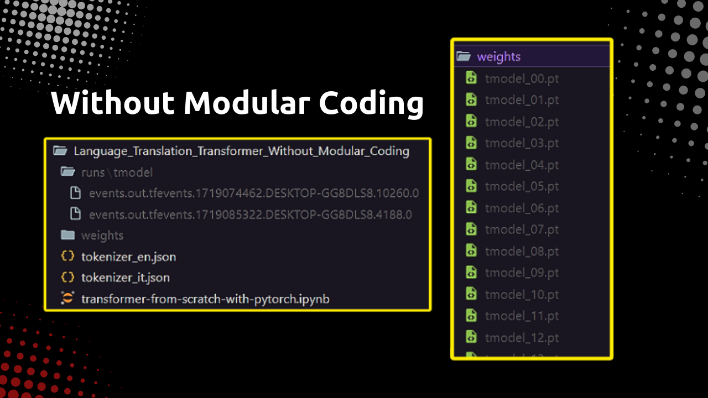

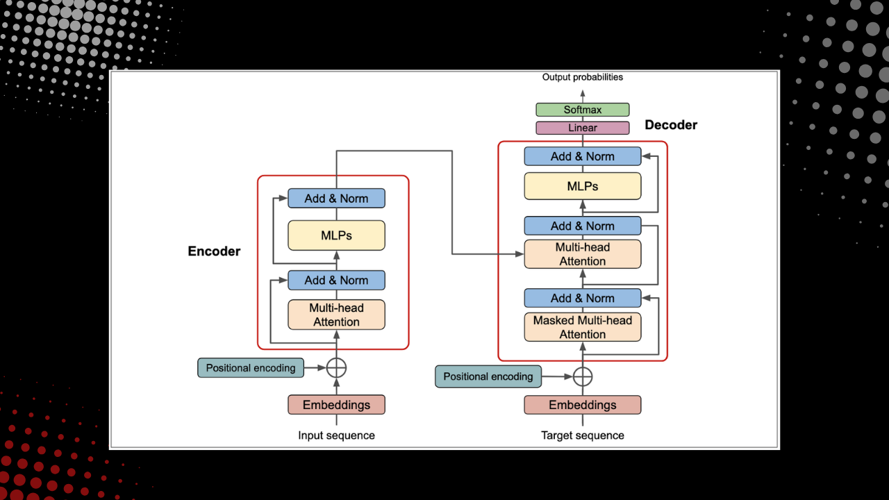
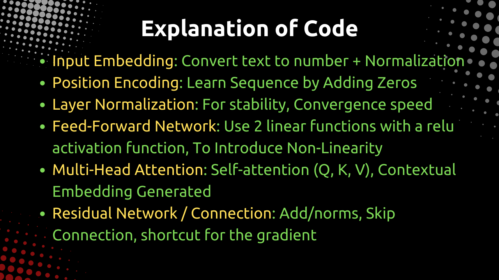
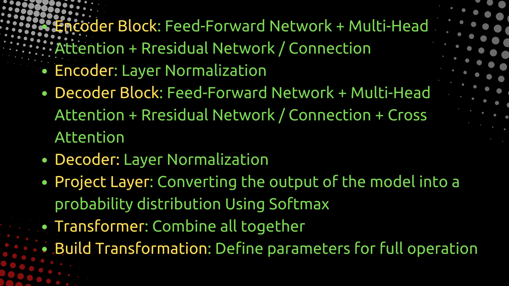
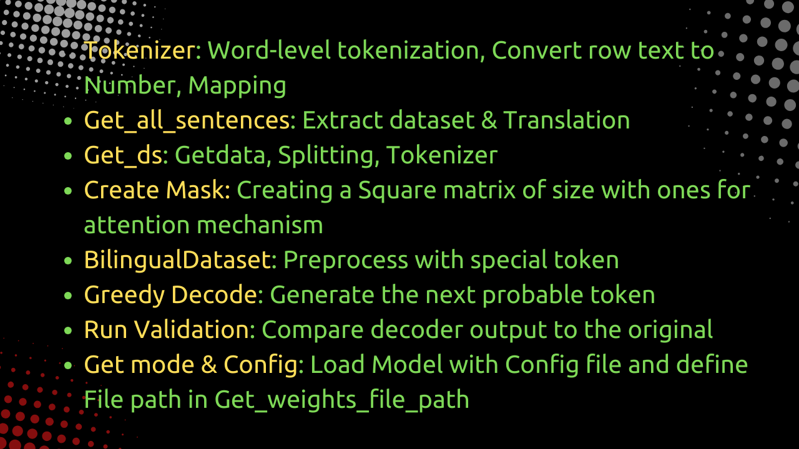
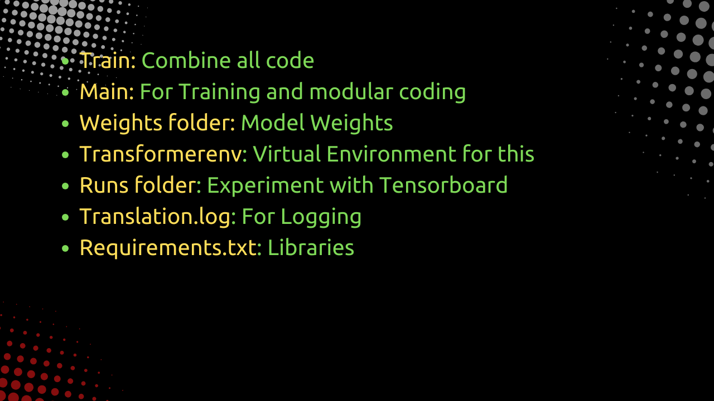

# PDF link : [Link Text](Transformer.pdf)
